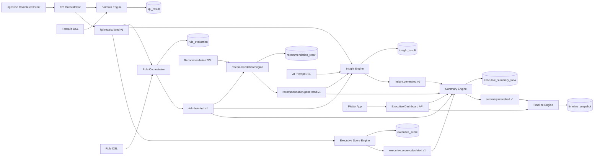

# Diagrama de Arquitetura - Executive Intelligence v1.0

Date: 2026-07-10
Status: Proposed

## Observações

1. Todos os módulos operam com isolamento por company_id.
2. Todos os cálculos e decisões são auditáveis por orchestrator_run_id.
3. Todos os motores usam apenas modelo canônico e DSLs oficiais.
