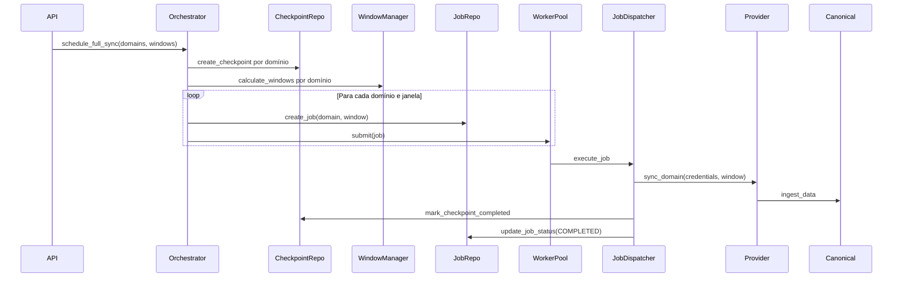
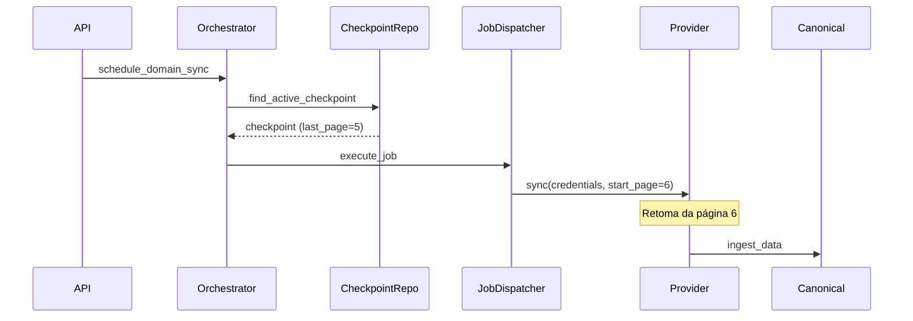

# Synchronization Orchestrator

## Visão Geral

O **Synchronization Orchestrator** é um módulo de orquestração inteligente para sincronizações de dados de provedores externos (Omie, SAP, TOTVS, Conta Azul, Bling, Tiny, etc.). Ele resolve o problema de sincronizações monolíticas que não escalam para grandes volumes de dados, implementando:

- ✅ **Sincronização por Domínio**: Cada domínio (clientes, produtos, vendas, etc.) é um job independente
- ✅ **Checkpoints**: Recuperação automática a partir do último ponto em caso de falha
- ✅ **Janelas Temporais**: Particionamento inteligente de dados em períodos gerenciáveis
- ✅ **Scheduler Inteligente**: Execução automática com frequências configuráveis por domínio
- ✅ **Fila com Prioridades**: CRITICAL, HIGH, NORMAL, LOW
- ✅ **Pipeline Único**: Execução de pipeline apenas após conclusão de todos os jobs planejados
- ✅ **Escalabilidade**: Suporta milhões de registros respeitando limites de API

## Arquitetura

```
┌─────────────────────────────────────────────────────────────┐
│                     SCHEDULER                                │
│  (Agendamento automático por domínio)                       │
└────────────────┬────────────────────────────────────────────┘
                 │
                 ▼
┌─────────────────────────────────────────────────────────────┐
│               ORCHESTRATOR                                   │
│  (Coordenação de jobs, batches, pipeline)                   │
└────────────────┬────────────────────────────────────────────┘
                 │
                 ▼
┌─────────────────────────────────────────────────────────────┐
│                JOB QUEUE                                     │
│  (Fila com prioridades)                                     │
└────────────────┬────────────────────────────────────────────┘
                 │
                 ▼
┌─────────────────────────────────────────────────────────────┐
│              WORKER POOL                                     │
│  (Execução concorrente de jobs)                             │
└────────────────┬────────────────────────────────────────────┘
                 │
                 ▼
┌─────────────────────────────────────────────────────────────┐
│            JOB DISPATCHER                                    │
│  (Despacho para provider correto)                           │
└────────────────┬────────────────────────────────────────────┘
                 │
                 ▼
┌─────────────────────────────────────────────────────────────┐
│              PROVIDER                                        │
│  (Omie, SAP, TOTVS, etc. - INALTERADOS)                    │
└────────────────┬────────────────────────────────────────────┘
                 │
                 ▼
┌─────────────────────────────────────────────────────────────┐
│           CANONICAL MODEL                                    │
│  (Modelo canônico v2 - INALTERADO)                         │
└────────────────┬────────────────────────────────────────────┘
                 │
                 ▼
┌─────────────────────────────────────────────────────────────┐
│             PIPELINE                                         │
│  (Execução única após batch completo)                       │
└─────────────────────────────────────────────────────────────┘
```

## Camadas (Clean Architecture)

```
synchronization/
├── domain/                 # Entidades e Value Objects
│   ├── entities.py        # SyncJob, SyncCheckpoint, TimeWindow, SyncBatch
│   └── value_objects.py   # JobStatus, JobPriority, SyncDomain, CheckpointStatus
├── application/           # Casos de uso
│   ├── orchestrator.py   # Coordenação principal
│   ├── scheduler.py      # Agendamento automático
│   └── job_dispatcher.py # Despacho para providers
├── infrastructure/        # Implementações
│   ├── repositories.py   # CheckpointRepository, JobRepository
│   ├── window_manager.py # Gerenciamento de janelas temporais
│   ├── sync_runtime.py   # Métricas e estado
│   ├── worker_pool.py    # Pool de workers
│   └── container.py      # Injeção de dependências
└── interfaces/            # API REST
    └── api/
        ├── routes.py     # Endpoints FastAPI
        └── schemas.py    # Schemas Pydantic
```

## Conceitos Principais

### 1. **Domínios (Domains)**

Cada domínio representa um tipo de dados a ser sincronizado:

- `customers` - Clientes
- `products` - Produtos
- `sales` - Vendas
- `accounts_receivable` - Contas a Receber
- `accounts_payable` - Contas a Pagar
- `cashflow` - Fluxo de Caixa
- `inventory` - Estoque
- `hr` - Recursos Humanos

### 2. **Jobs**

Cada job sincroniza **um único domínio**. Nunca mais um job gigante sincronizando tudo.

**Estados do Job:**
- `PENDING` - Aguardando execução
- `RUNNING` - Em execução
- `PAUSED` - Pausado (pode ser retomado)
- `COMPLETED` - Concluído com sucesso
- `FAILED` - Falhou (pode ser retentado)
- `CANCELLED` - Cancelado

### 3. **Checkpoints**

Cada job possui um checkpoint que registra:
- Última página processada
- Último cursor
- Último registro processado
- Última janela temporal processada
- Última sincronização bem-sucedida

**Em caso de falha**, o job retoma exatamente de onde parou.

### 4. **Janelas Temporais (Time Windows)**

Dados são particionados em janelas temporais:

**Exemplo: Vendas**
```
Janela 1: 01/01/2024 - 07/01/2024 (7 dias)
Janela 2: 08/01/2024 - 14/01/2024 (7 dias)
Janela 3: 15/01/2024 - 21/01/2024 (7 dias)
```

**Configuração por domínio** (em `synchronization.yaml`):
```yaml
sales:
  window_days: 7      # Janelas de 7 dias
  
customers:
  window_days: 3650   # Janela única de 10 anos (clientes são estáveis)
```

### 5. **Prioridades**

Jobs possuem prioridades:

- `CRITICAL` - Peso 1000
- `HIGH` - Peso 100
- `NORMAL` - Peso 10
- `LOW` - Peso 1

**Exemplo:**
```yaml
cashflow:
  priority: high      # Alta prioridade (dados financeiros críticos)
  
customers:
  priority: low       # Baixa prioridade (dados mestres menos dinâmicos)
```

### 6. **Scheduler**

O scheduler executa sincronizações automaticamente:

**Configuração de frequência:**
```yaml
sales:
  frequency: 15m      # A cada 15 minutos

accounts_receivable:
  frequency: 30m      # A cada 30 minutos

customers:
  frequency: daily    # Uma vez por dia
```

### 7. **Batches**

Um batch é um conjunto de jobs que devem ser executados juntos:
- Todos os jobs de um batch compartilham o mesmo `company_id` e `provider`
- O pipeline é executado apenas quando **todos os jobs do batch são concluídos**

### 8. **Pipeline Único**

**Antes:** Pipeline executado após cada domínio (ineficiente)
```
Clientes → Pipeline
Produtos → Pipeline
Vendas → Pipeline
...
```

**Agora:** Pipeline executado uma única vez após todos os jobs
```
Clientes ┐
Produtos │
Vendas   ├─→ Aguarda todos → Pipeline (uma vez)
...      │
RH       ┘
```

## Fluxo de Sincronização

### Full Sync



### Recuperação após Falha



## API Endpoints

### Health

```http
GET /v1/synchronization/health
```

**Response:**
```json
{
  "orchestrator": "running",
  "worker_pool": {
    "running": true,
    "queue_size": 3,
    "max_workers": 4
  },
  "runtime": {
    "scheduler_running": true,
    "active_jobs": 2,
    "metrics": { ... }
  }
}
```

### Listar Jobs

```http
GET /v1/synchronization/jobs?company_id=xxx&provider=omie
```

**Response:**
```json
{
  "total": 10,
  "jobs": [
    {
      "job_id": "uuid",
      "company_id": "company-1",
      "provider": "omie",
      "domain": "sales",
      "status": "completed",
      "records_imported": 1500,
      "duration_seconds": 45.3
    }
  ]
}
```

### Obter Job

```http
GET /v1/synchronization/jobs/{job_id}
```

### Pausar Job

```http
POST /v1/synchronization/jobs/{job_id}/pause
```

### Cancelar Job

```http
POST /v1/synchronization/jobs/{job_id}/cancel
```

### Listar Checkpoints

```http
GET /v1/synchronization/checkpoints?company_id=xxx&domain=sales
```

**Response:**
```json
{
  "total": 5,
  "checkpoints": [
    {
      "checkpoint_id": "uuid",
      "domain": "sales",
      "status": "active",
      "last_page": 10,
      "last_window_start": "2024-01-01",
      "last_window_end": "2024-01-07"
    }
  ]
}
```

### Métricas de Runtime

```http
GET /v1/synchronization/runtime
```

**Response:**
```json
{
  "scheduler_running": true,
  "active_jobs": 3,
  "metrics": {
    "global": {
      "jobs_total": 150,
      "jobs_completed": 145,
      "jobs_failed": 5,
      "records_imported": 50000,
      "avg_duration_seconds": 32.5
    },
    "per_domain": {
      "sales": {
        "jobs_completed": 50,
        "records_imported": 20000
      }
    }
  }
}
```

### Scheduler

#### Obter Status

```http
GET /v1/synchronization/scheduler/status
```

#### Iniciar Scheduler

```http
POST /v1/synchronization/scheduler/start
```

#### Parar Scheduler

```http
POST /v1/synchronization/scheduler/stop
```

## Configuração

### synchronization.yaml

```yaml
# Customers - Dados mestres, baixa frequência
customers:
  frequency: daily
  window_days: 3650
  priority: low
  enabled: true
  max_parallel_jobs: 1

# Sales - Alta frequência, janelas curtas
sales:
  frequency: 15m
  window_days: 7
  priority: high
  enabled: true
  max_parallel_jobs: 1

# Cashflow - Muito alta frequência
cashflow:
  frequency: 10m
  window_days: 30
  priority: high
  enabled: true
  max_parallel_jobs: 1
```

**Parâmetros:**
- `frequency`: "daily", "hourly", "15m", "30m", "2h"
- `window_days`: Número de dias por janela (0 = janela única)
- `priority`: "critical", "high", "normal", "low"
- `enabled`: true/false
- `max_parallel_jobs`: Máximo de jobs paralelos por domínio

### Variáveis de Ambiente

```bash
SYNC_MAX_WORKERS=4  # Número de workers no pool
```

## Banco de Dados

### Tabela: sync_checkpoints

```sql
CREATE TABLE sync_checkpoints (
    checkpoint_id VARCHAR(36) PRIMARY KEY,
    company_id VARCHAR(36) NOT NULL,
    provider VARCHAR(50) NOT NULL,
    domain VARCHAR(50) NOT NULL,
    status VARCHAR(20) NOT NULL,
    last_page INTEGER,
    last_cursor TEXT,
    last_success_sync TIMESTAMP,
    last_processed_record TEXT,
    last_window_start DATE,
    last_window_end DATE,
    metadata JSONB,
    created_at TIMESTAMP NOT NULL,
    updated_at TIMESTAMP NOT NULL
);
```

### Tabela: sync_jobs

```sql
CREATE TABLE sync_jobs (
    job_id VARCHAR(36) PRIMARY KEY,
    company_id VARCHAR(36) NOT NULL,
    provider VARCHAR(50) NOT NULL,
    domain VARCHAR(50) NOT NULL,
    priority VARCHAR(20) NOT NULL,
    status VARCHAR(20) NOT NULL,
    mode VARCHAR(20) NOT NULL,
    checkpoint_id VARCHAR(36),
    window_start DATE,
    window_end DATE,
    window_id VARCHAR(36),
    retry_count INTEGER,
    max_retries INTEGER,
    records_read INTEGER,
    records_imported INTEGER,
    records_failed INTEGER,
    pages_processed INTEGER,
    started_at TIMESTAMP,
    completed_at TIMESTAMP,
    failed_at TIMESTAMP,
    error_message TEXT,
    metadata JSONB,
    created_at TIMESTAMP NOT NULL,
    updated_at TIMESTAMP NOT NULL
);
```

## Métricas

O sistema registra:
- Jobs executados (total, completos, falhos, cancelados)
- Registros processados (total, importados, falhos)
- Páginas processadas
- Checkpoints criados e restaurados
- Janelas processadas
- Execuções de pipeline
- Tempo médio por job
- Tempo médio por domínio

## Benefícios

### Antes (Monolítico)

❌ Um único job sincroniza todos os domínios  
❌ Falha em um domínio interrompe tudo  
❌ Reinício sempre do zero  
❌ Não escala para grandes volumes  
❌ Ultrapassar limites de API  
❌ Pipeline executado múltiplas vezes  

### Depois (Orquestrado)

✅ Jobs independentes por domínio  
✅ Falha isolada (outros domínios continuam)  
✅ Recuperação do último checkpoint  
✅ Escala para milhões de registros  
✅ Respeita limites de API  
✅ Pipeline executado uma única vez  
✅ Scheduler inteligente  
✅ Priorização de domínios críticos  

## Exemplo de Uso

### Agendar Full Sync Completo

```python
from app.modules.synchronization.infrastructure.container import get_orchestrator

orchestrator = get_orchestrator()

batch = orchestrator.schedule_full_sync(
    company_id="company-1",
    provider="omie",
    domains=[
        SyncDomain.CUSTOMERS,
        SyncDomain.PRODUCTS,
        SyncDomain.SALES,
    ],
    encrypted_credentials=encrypted_creds,
    window_config={
        "customers": 3650,  # 10 anos
        "products": 3650,
        "sales": 7,         # 1 semana
    },
    priority_config={
        "sales": JobPriority.HIGH,
        "customers": JobPriority.LOW,
    },
)

print(f"Batch {batch.batch_id} criado com {len(batch.jobs)} jobs")
```

### Agendar Sync Incremental de Vendas

```python
job = orchestrator.schedule_domain_sync(
    company_id="company-1",
    provider="omie",
    domain=SyncDomain.SALES,
    encrypted_credentials=encrypted_creds,
    mode="incremental",
    priority=JobPriority.HIGH,
)

print(f"Job {job.job_id} agendado")
```

### Verificar Status de Job

```python
status = orchestrator.get_job_status(job_id)
print(f"Status: {status['status']}")
print(f"Registros importados: {status['records_imported']}")
```

## Extensibilidade

### Adicionar Novo Provider (SAP, TOTVS, etc.)

O orchestrator é **agnóstico ao provider**. Para adicionar um novo:

1. Implementar provider seguindo interface existente
2. Registrar no provider registry
3. **Nenhuma alteração** no orchestrator necessária

### Adicionar Novo Domínio

1. Adicionar enum em `SyncDomain`
2. Adicionar método `sync_<domain>` no provider
3. Adicionar mapeamento em `JobDispatcher._get_sync_method_for_domain()`
4. Adicionar configuração em `synchronization.yaml`

## Resiliência

- **Retry**: Jobs falhos podem ser retentados (configurável por job)
- **Checkpoint**: Recuperação automática do último ponto
- **Circuit Breaker**: Herança do provider (inalterado)
- **Rate Limiting**: Herança do provider (inalterado)
- **Timeout**: Configurável por provider

## Monitoramento

### Logs

Todos os componentes emitem logs estruturados:

```json
{
  "timestamp": "2024-07-24T10:30:00Z",
  "level": "INFO",
  "logger": "app.synchronization.orchestrator",
  "message": "Job completed successfully",
  "job_id": "uuid",
  "company_id": "company-1",
  "domain": "sales",
  "records_imported": 1500,
  "duration_seconds": 45.3
}
```

### Métricas

Expostas via `/v1/synchronization/runtime`:
- Taxa de sucesso
- Latência média
- Throughput
- Jobs ativos
- Tamanho da fila

## Conclusão

O **Synchronization Orchestrator** transforma sincronizações monolíticas em um sistema orquestrado, escalável e resiliente, capaz de:

✅ Sincronizar milhões de registros  
✅ Respeitar limites de API  
✅ Recuperar automaticamente de falhas  
✅ Priorizar domínios críticos  
✅ Executar sincronizações automáticas  
✅ Escalar horizontalmente  
✅ Suportar múltiplos providers (Omie, SAP, TOTVS, Bling, Tiny, Conta Azul, etc.)  

**O provider permanece inalterado. O orchestrator é uma camada superior que coordena a execução.**
